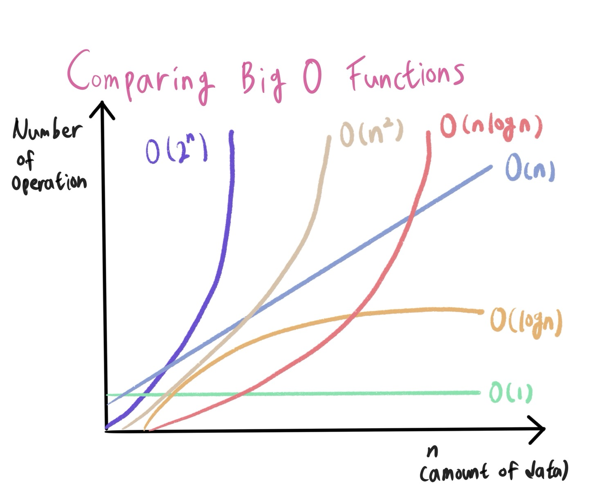

# ⏱ 시간 복잡도 & 빅오 표기법

## 1. 알고리즘의 시간 복잡도

**좋은 알고리즘이란?** 

>  Input을 넣은 후 Output이 나오는 **시간**이 짧은 알고리즘

<br>

### 알고리즘의 소요 시간 측정하기

개개인의 컴퓨팅 환경에 따라 같은 알고리즘이라도 측정 시간이 다르다. **환경에 영향을 받지 않는 객관적인 기준**이 필요함

> 객관적인 측정을 위해 알고리즘 내부에서 **기본연산이 몇 번 일어나는지** 살펴본다.

`기본연산의 총 횟수 == 알고리즘의 소요 시간`

따라서 성능을 측정할 때는 **입력을 통일**시킨다.

입력 n개에 따른 소요 시간을 수식으로 세울 수 있다. == `시간 복잡도(Time Complexity)`

<br>

### 시간 복잡도 (Time Complexity)

> 계산 복잡도 이론에서 시간 복잡도는 문제를 해결하는데 걸리는 시간과 입력의 함수 관계를 가리킨다.

단순하게 **알고리즘의 수행시간**을 의미함

- 시간 복잡도가 높다 => 느린 알고리즘

- 시간 복잡도가 낮다 => 빠른 알고리즘

#### 성능 비교

1. 3n + 2 => 선형 증가
2. 6n + 4 => 선형 증가
3. 3n^2 + 6n + 1 => 제곱으로 증가

> 앞에 계수는 큰 영향을 주지 않음.
>
> 제곱이 큰 영향을 줌.

<br>

## 2. 빅오(Big-O) 표기법

> 입력 n이 **무한대**로 커진다고 가정하고 시간 복잡도를 간단하게 표시하는 것. **최고차항**만 남기고 계수와 상수 제거

컴퓨터는 기본 10억 단위의 연산을 하기 때문.

매 입력에 따라 정확한 수식을 구하는 것은 불필요하다. 정확한 수치보다는 **증가율**에 초점을 맞춘다

1. 3n + 2 => `O(n)`
2. 6n + 4 => `O(n)`
3. 3n^2 + 6n + 1 => `O(n^2)`

<br>

#### 다양한 시간 복잡도 종류



- `O(1)`: 단순 산술 계산 (덧셈, 뺄셈, 곱셈, 나눗셈)
  - a + b, 100 * 200
- `O(logN)`: 크기 N인 리스트를 반절씩 순회/탐색
  - 이진탐색(Binary Search), 분할정복(Divide & Conquer)
- `O(N)`: 크기 N인 리스트를 순회
  - 리스트 순회, 1중 for 문, count 함수
- `O(NlogN)`: 크기 N인 리스트를 반절씩 탐색*순회
  - 높은 성능의 정렬(Merge/Quick/Heap Sort)
- `O(N^2)`: 크기 M,N인 2중 리스트를 순회
  - 2중 for 문
- `O(N^3)`: 3중 리스트를 순회
  - 3중 for 문
- `O(2^N)`: 크기 N 집합의 부분 집합
- `O(N!)`: 크기 N 리스트의 순열

> 반복문이 많아질 수록 시간 복잡도가 높아짐

<br>

#### (일반적인 상황에서) 1초가 걸리는 입력의 크기

- `O(N)`: 1억 (기준)
- `O(NlogN)`: 500만
- `O(N^2)`: 1만
- `O(N^3)`: 500
- `O(2^N)`: 20
- `O(N!)`: 10

<br>

### 예시

#### 1. 1부터 n까지 일일히 더하기

```python
def get_total(n): total = 0
    for i in range(1, n + 1):
        total += i
    return total
print(get_total(10))
>>> 55
print(get_total(1000000000)) >>> 제한 시간 1초 초과
```

#### 2. 가우스의 합 공식

```python
def get_total(n):
    return (n * (n + 1)) // 2:
print(get_total(10))
# 55
print(get_total(1000000000))
>>> 500000000500000000
```

> 같은 Output을 만드는 알고리즘이라도 시간 복잡도에 따라 **성능**이 달라질 수 있고 시험에서 **정답 여부**가 갈리는 포인트가 된다는 것이다.

<br>

### 내장 함수, 메서드의 시간 복잡도도 확인할 필요가 있다.

> **Q. for문을 1번만 썼는데 왜 시간초과가 날까요?**
>
> for문이 1번이라고 해서 무조건 O(n)인 것은 아님. for문 안에 O(n)의 `내장 함수`를 사용했다면 사실상 **이중 for문**과 다를 것이 없기 때문.

[[참고] Big-O Cheatsheet](https://wiki.python.org/moin/TimeComplexity)

- 이중 for문이 아닌 for문 다음 for문을 쓰게되면 `O(n^2)`이 아닌 `O(2N`)이 된다.
- `max()함수`를 for문 안에 쓰는 것과 for문 밖에 쓰는 것은 시간 복잡도가 다르다.