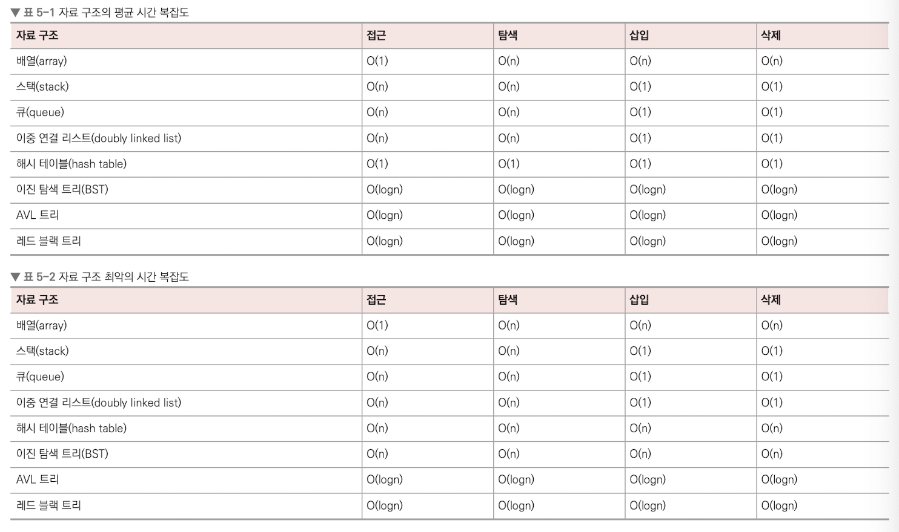

# 복잡도

> 자료 구조란 효율적으로 데이터를 관리, 수정, 삭제, 탐색, 저장할 수 있는 데이터 집합

## 시간 복잡도

> 시간 복잡도란 문제를 해결하는 데 걸리는 시간과 입력의 함수 관계

- 주로 Big-O(빅-오) 표기법을 사용하여 시간 복잡도를 표현한다.

<br>

### 빅오 표기법

> 입력 범위 n을 기준으로 로직이 몇번 반복되는지 나타내는 것

- 알고리즘이 최악일 경우를 가정하여 판단한다.


<br>

### Python 시간 측정 방법

```python
import time
start_time = time.time() # 측정 시작

''' 프로그램 소스코드 '''

end_time = time.time() # 측정 종료
print("time :", end_time - start_time) # 수행 시간 출력
```

<br>

## 공간 복잡도

> 공간 복잡도란 프로그램을 실행시켰을 때 필요로 하는 자원 공간의 양

- 메모리를 얼마나 사용하는지 나타낸다.

<br>

## 자료 구조에서의 시간 복잡도

