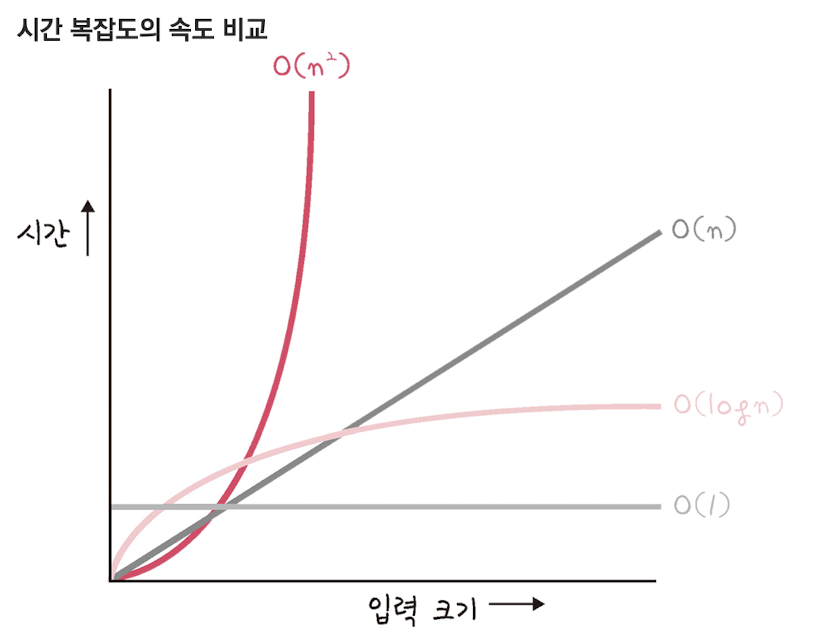
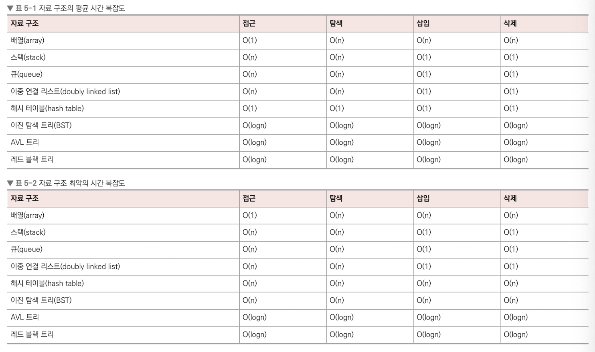

# 자료 구조

## 복잡도

> 자료 구조란 효율적으로 데이터를 관리, 수정, 삭제, 탐색, 저장할 수 있는 데이터 집합

### 시간 복잡도

> 시간 복잡도란 문제를 해결하는 데 걸리는 시간과 입력의 함수 관계

### 빅오 표기법

> 입력 범위 n을 기준으로 로직이 몇번 반복되는지 나타내는 것

 

### 공간 복잡도

> 공간 복잡도란 프로그램을 실행시켰을 때 필요로 하는 자원 공간의 양

 

## 선형 자료 구조