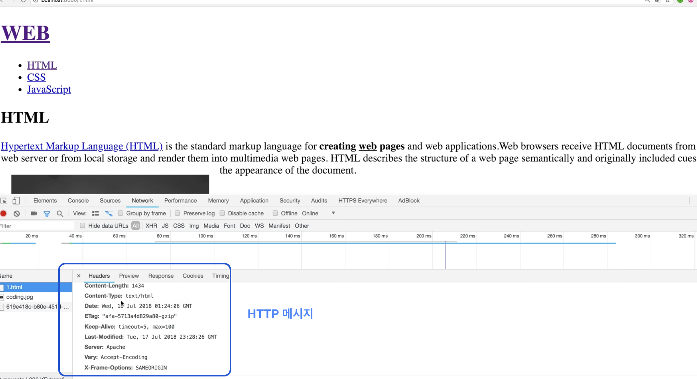
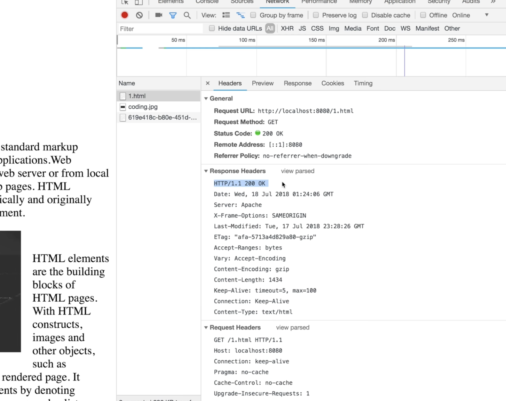

# HTTP

> HyperText Transfer Protocol

웹 브라우저와 웹 서버가 통신을 할 때 사용하는 통신 규칙

서로 컨텐츠(html,css,js,jpg...)를 주고받기 위해선 공통의 약속인 메시지가 필요한데 크게 **Request(요청)** 와 **Response(응답)** 메시지로 이루어짐

개발자 도구 network탭에서 웹 브라우저와 웹 서버가 어떤 통신을 하고 있는지 모니터링 할 수 있음

- Request Headers
  - 웹 브라우저가 웹 서버에게 요청하는 메시지

- Response Headers
  - 웹 서버가 웹 브라우저에게 응답하는 메시지

[생활코딩 HTTP](https://www.youtube.com/watch?v=NXEeQgm0m8Q&list=PLuHgQVnccGMBd-v_DjNm61EBaDpYZSV1Z&index=1)

 

- HTTP/1.0
  - 한 연결당 하나의 요청만 처리 
    - 시간이 오래 걸림, RTT 증가(Round Trip Time)

- [HTTP/1.1 – 표준 프로토콜](https://developer.mozilla.org/ko/docs/Web/HTTP/Basics_of_HTTP/Evolution_of_HTTP#http1.1_–_표준_프로토콜)
  - 여러 개의 파일을 주고받을 수 있게 됨(keep-alive)
  - 헤더에 쿠기등 많은 데이터가 있고 압축이 되지 않아서 무거움
  - HOL Blocking(Head of line blocking) 발생
    - 여러 개의 파일을 다운받는데 만약 첫번째 파일이 느리게 받아지면 그 뒤에 있는 파일도 대기하면서 지연되는 상태
- [HTTP/2 – 더 나은 성능을 위한 프로토콜](https://developer.mozilla.org/ko/docs/Web/HTTP/Basics_of_HTTP/Evolution_of_HTTP#http2_–_더_나은_성능을_위한_프로토콜)
  - 지연 시간을 줄이고 응답 시간을 더 빠르게 할 수 있음,
  - 멀티플렉싱
    - 특정 파일이 손실되어도 다른 파일은 멀쩡히 동작함
    - HOL Blocking 해결
  - 헤더 압축
    - 허프만 코딩
  - 서버 푸시
    - 클라이언트 요청 없이 서버가 바로 파일을 줄 수 있다.
  - 요청의 우선순위 처리를 지원함
  - 어느 정도의 제한된 액터 세트만이 HTTP/2 채택을 불러일으키는데 필요했으며 브라우저와 서버 버전이 교체됨에 따라, 웹 개발자의 투입없이도 HTTP/2의 사용은 자연스럽게 증가했습니다.

- [HTTP/3 - HTTP over QUIC](https://developer.mozilla.org/ko/docs/Web/HTTP/Basics_of_HTTP/Evolution_of_HTTP#http/3 - http over quic)

HTTP는 텍스트 교환이므로, 누군가 네트워크에서 신호를 가로채면 내용이 노출되는 보안 이슈가 존재한다.

이런 보안 문제를 해결해주는 프로토콜이 **'HTTPS'**

### HTTPS(HyperText Transfer Protocol Secure)

인터넷 상에서 정보를 암호화하는 SSL 프로토콜을 사용해 클라이언트와 서버가 자원을 주고 받을 때 쓰는 통신 규약. HTTPS는 텍스트를 암호화한다.

