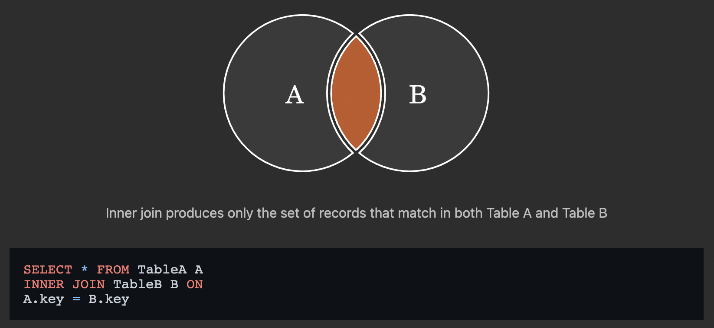
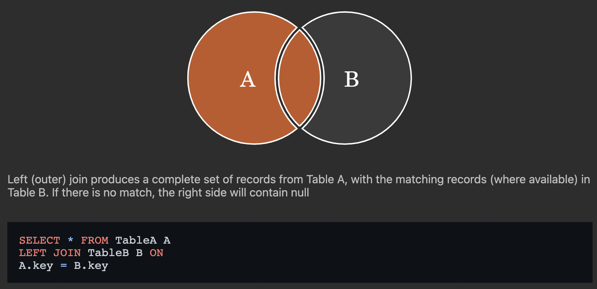

# 🔗 Join

> 관계형 데이터베이스의 가장 큰 장점이자 핵심적인 기능

- 일반적으로 데이터베이스에는 하나의 테이블에 많은 데이터를 저장하는 것이 아니라 여러 테이블로 나눠 저장하게 되며, 여러 테이블을 결합(Join)하여 출력하여 활용
- 일반적으로 레코드는 기본키(PK)나 외래키(FK) 값의 관계에 의해 결합함

<br>

## 대표적인 JOIN

- `INNER JOIN` : 두 테이블에 모두 일치하는 행만 반환
- `OUTER JOIN` : 동일한 값이 없는 행도 반환
- `CROSS JOIN` : 모든 데이터의 조합

<br>

### `INNER JOIN`

> 조건에 일치하는(동일한 값이 있는) 행만 반환

```sql
SELECT *
FROM 테이블1 [INNER] JOIN 테이블2
ON 테이블1.칼럼 = 테이블2.칼럼;
```



<br>

### `OUTER JOIN`

> 동일한 값이 없는 데이터도 반환할 때 사용

- 기준이 되는 테이블에 따라 LEFT/RIGHT/FULL을 지정

```sql
SELECT *
FROM 테이블1 [LEFT|RIGHT|FULL] OUTER JOIN 테이블2
ON 테이블1.칼럼 = 테이블2.칼럼;
```



<br>

### `CROSS JOIN`

> 모든 가능한 경우의 수의 Join

```sql
SELECT *
FROM 테이블1 CROSS JOIN 테이블2;
```

<br>

#### 예시

```sql
CREATE TABLE users (
    id INT PRIMARY KEY,
    name TEXT,
    role_id INT
);

INSERT INTO users VALUES 
    (1, '관리자', 1),
    (2, '김철수', 2),
    (3, '이영희', 2);

CREATE TABLE role (
    id INT PRIMARY KEY, 
    title TEXT
);

INSERT INTO role VALUES 
    (1, 'admin'),
    (2, 'staff'),
    (3, 'student');

CREATE TABLE articles (
    id INT PRIMARY KEY, 
    title TEXT,
    content TEXT,
    user_id INT
);

INSERT INTO articles VALUES 
    (1, '1번글', '111', 1),
    (2, '2번글', '222', 2),
    (3, '3번글', '333', 1),
    (4, '4번글', '444', NULL);

-- 확인
.mode column
SELECT * FROM users;
SELECT * FROM role;
SELECT * FROM articles;

-- INNER JOIN
-- A와 B테이블에서 값이 일치하는 것들만 
SELECT *
FROM users INNER JOIN role
    ON users.role_id = role.id;
-- id  name  role_id  id  title
-- --  ----  -------  --  -----
-- 1   관리자   1        1   admin
-- 2   김철수   2        2   staff
-- 3   이영희   2        2   staff

SELECT 
    users.name, 
    role.title
FROM users INNER JOIN role
    ON users.role_id = role.id;
-- name  title
-- ----  -----
-- 관리자   admin
-- 김철수   staff
-- 이영희   staff

-- 스태프(2)만 출력
SELECT *
FROM users INNER JOIN role
    ON users.role_id = role.id
WHERE role.id = 2;
-- id  name  role_id  id  title
-- --  ----  -------  --  -----
-- 2   김철수   2        2   staff
-- 3   이영희   2        2   staff

-- 이름을 내림차순으로 출력하세요.
SELECT *
FROM users INNER JOIN role
    ON users.role_id = role.id
ORDER BY users.name DESC;
-- id  name  role_id  id  title
-- --  ----  -------  --  -----
-- 3   이영희   2        2   staff
-- 2   김철수   2        2   staff
-- 1   관리자   1        1   admin

-- LEFT OUTER JOIN
SELECT * 
FROM articles LEFT OUTER JOIN users
    ON articles.user_id = users.id;

-- id  title  content  user_id  id  name  role_id
-- --  -----  -------  -------  --  ----  -------
-- 1   1번글    111      1        1   관리자   1
-- 2   2번글    222      2        2   김철수   2
-- 3   3번글    333      1        1   관리자   1
-- 4   4번글    444

SELECT * 
FROM articles LEFT OUTER JOIN users
    ON articles.user_id = users.id
WHERE articles.user_id IS NOT NULL;
-- id  title  content  user_id  id  name  role_id
-- --  -----  -------  -------  --  ----  -------
-- 1   1번글    111      1        1   관리자   1
-- 2   2번글    222      2        2   김철수   2
-- 3   3번글    333      1        1   관리자   1

SELECT * 
FROM articles FULL OUTER JOIN users
    ON articles.user_id = users.id;

-- CROSS JOIN
SELECT * 
FROM users CROSS JOIN role;
-- id  name  role_id  id  title
-- --  ----  -------  --  -------
-- 1   관리자   1        1   admin
-- 1   관리자   1        2   staff
-- 1   관리자   1        3   student
-- 2   김철수   2        1   admin
-- 2   김철수   2        2   staff
-- 2   김철수   2        3   student
-- 3   이영희   2        1   admin
-- 3   이영희   2        2   staff
-- 3   이영희   2        3   student

-- 3개의 테이블 조인
SELECT * 
FROM articles
    JOIN users
        ON articles.user_id = users.id
    JOIN role
        ON users.role_id = role.id;
-- id  title  content  user_id  id  name  role_id  id  title
-- --  -----  -------  -------  --  ----  -------  --  -----
-- 1   1번글    111      1        1   관리자   1        1   admin
-- 2   2번글    222      2        2   김철수   2        2   staff
-- 3   3번글    333      1        1   관리자   1        1   admin
```


---

[참고 사이트](https://sql-joins.leopard.in.ua/)