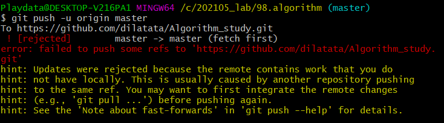

# 📗 GitHub

> 네트워크를 활용한 원격저장소 (Remote Repository)

- `push`와 `pull`을 통해 다른사람과 협업이 가능하다.


## 원격 저장소 기본 흐름

- 로컬 -> push -> 원격 -> pull -> 로컬


## 기본 명령어


### 원격 저장소 경로 설정 및 확인

- `git remote add origin 원격 저장소 url`

  > 깃아 원격저장소 추가해줘 오리진이라는 이름으로 url을

  - remote(원격 저장소)를 origin으로해서 url 대신 push할 수 있게 한다.

- 원격 저장소 정보를 로컬 저장소에 추가
- 로컬 저장소에는 한번만 설정 해주면 된다.
  - git 마다, 프로젝트마다 원격 저장소 각각 만들어서 각각 설정 해야 한다.
- 원격 저장소 이름과 폴더 이름이 달라도 된다.


- `git remote -v`

  원격 저장소의 정보를 확인함


### push

- `git push origin(원격 저장소 이름) master(브랜치 이름)`

  로컬 저장소가 아닌 원격 저장소의 버전(커밋)이 올라감


### pull

- `git pull origin master`

  원격 저장소로부터 변경된 내역을 받아와서 이력을 병합함


#### push 주의 사항

- 깃헙에서 눈에 보이는 파일은 그냥 최신 버전 커밋의 상태를 표현할 뿐, 절대로 파일,폴더를 관리하는 것이 아니다. **버전 관리임**

  - 커밋이 없으면 당연히 `push`도 안된다.

    - 그래서 `git status`, `git log`로 상태 확인을 통해 커밋 되지 않은 파일 확인해야 한다.

    ```bash
    Everything up-to-date
    ```

    >  새로운 커밋이 없어서 푸쉬 안됨


#### push 실패 경우



> 로컬과 원격 저장소의 커밋 이력이 다른 경우 발생한 것이다.


1. 원격저장소의 커밋을 원격저장소로 가져와서 `pull` 

2. 로컬에서 두 커밋을 병합 `merge` (추가 커밋 발생)

   *동시에 같은 파일이 수정된 경우 merge conflict가 발생하나 이 부분은 브랜치 학습*

3. 다시 GitHub으로 `push`


### clone

- `git clone 원격 저장소 주소`

  원격 저장소를 복제하여 로컬 저장소로 모든 버전을 가져온다.

  - **원격 저장소 이름의 폴더로 이동**해서 활용해야함

- `.git` 폴더가 존재하므로 `git init`을 하면 안된다.

- 협업 시 무조건 `clone` 해야한다.

- 원격 저장소의 주인이 `push`를 했다면 `pull`을 통해 최신 버전을 받을 수 있다.

  - 나는 원격 저장소 주인의 초대로 권한을 줘야 `push`가 가능하다


#### 압축(Zip) 다운로드

> 최신 버전의 파일(폴더)만 가져온다. git으로 관리 안되므로 .git 폴더가 없다.


## .gitignore

> 깃 버전 관리를 하지 않는 파일들을 따로 모으는 파일

- `touch .gitignore`

  Git 저장소에 `.gitignore` 파일을 생성하고 해당 내용을 관리한다.

- 작성 예시

  - 특정 파일 : a.txt (모든 a.txt), test/a.txt (테스트 폴더의 a.txt)
  - 특정 디렉토리 : /my_secret
  - 특정 확장자 : *.exe (\*은 wildcard, 모든것을 뜻함, exe파일 모두 제외)
  - 예외 처리 : !b.exe

- **주의!** 

  이미 커밋된 파일은 반드시 삭제 해야 `.gitignore` 로 적용된다.

  - 프로젝트 시작전에 미리 `.gitignore` 파일을 만들어야 하며, 각 프로젝트 마다 설정해야 한다.


### .gitignore 설정 사이트

- https://github.com/github/gitignore

- https://gitignore.io/

  1. 검색창에 '파이썬 - 비주얼 스튜디오 - 맥'을 검색한다.

  2. 전부 복사하고 .gitignore에 붙인 후 저장하면 된다.

     해당 환경에서 개발과 상관없는 파일은 알아서 제외시킨다.