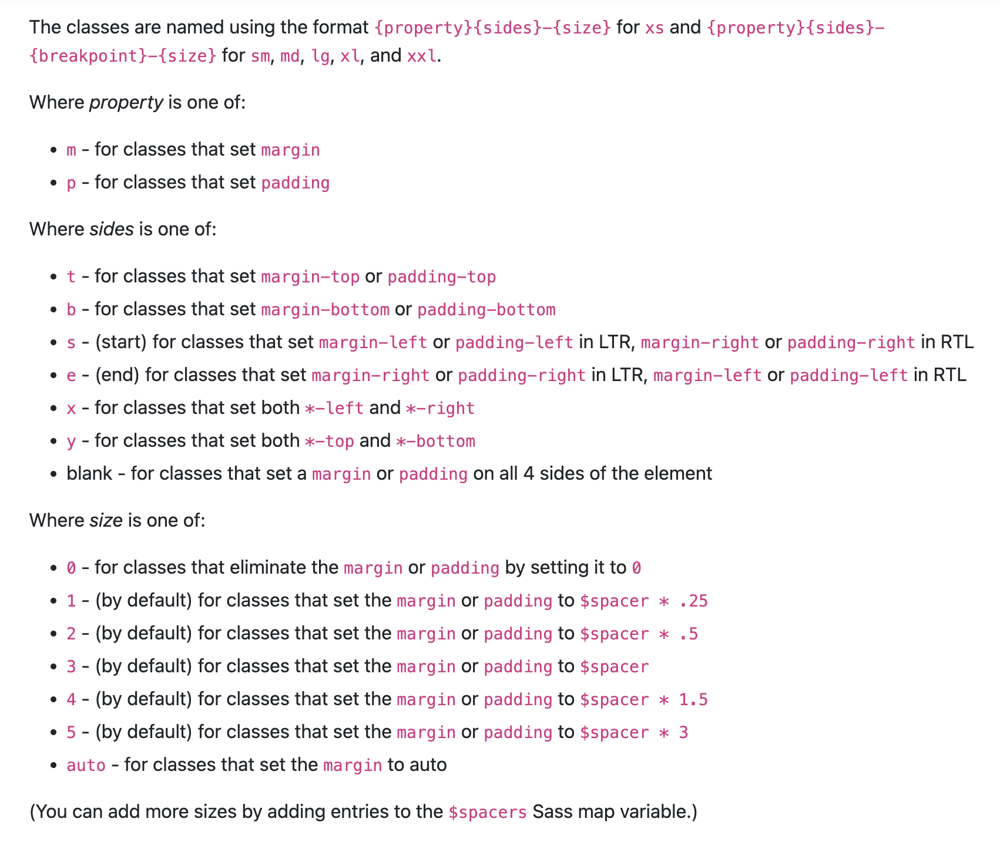
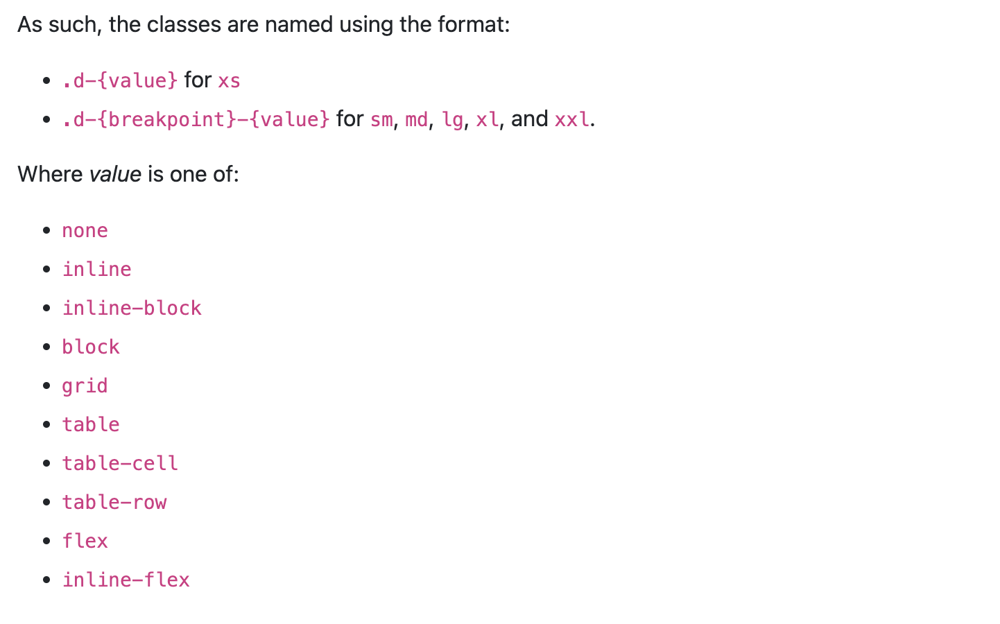

# 🪟 HTML 문서 구조화

## table

- table의 각 영역을 명시하기 위해 `<thead>` `<tbody>` `<tfoot>` 요소를 활용 (필수가 아닌 선택)
-  `<tr>`
  - 가로 줄(행) 구성

- `<th>`
  - 헤더 구성
- `<td>`
  - 각 데이터(열) 구성
- `colspan`, `rowspan` 속성을 활용하여 셀 병합
  - `colspan=“2”` : 열 2칸 병합
- `<caption>`을 통해 표 설명 또는 제목을 나타냄

#### table 태그 기본 구성

- thead
  - tr > th
- tbody
  - tr > td
- tfoot
  - tr > td
- caption

<br>

## form

> `<form>`은 정보(데이터)를 서버에 제출하기 위해 사용하는 태그

- `<form>` 기본 속성

  - `action` : form을 처리할 서버의 URL(데이터를 보낼 곳)
  - `method` : form을 제출할 때 사용할 HTTP 메서드 (GET 혹은 POST)
  - `enctype` : method가 post인 경우 데이터의 유형
    - `application/x-www-form-urlencoded` : 기본값
    - `multipart/form-data` : 파일 전송시 (input type이 file인 경우)
    - `text/plain` : HTML5 디버깅 용 (잘 사용되지 않음)

  ```html
  <form action="/search" method="GET"> </form>
  ```

  - 구글 검색창

<br>

## input

> 다양한 타입을 가지는 입력 데이터 유형과 위젯이 제공됨

- `<input>` 대표적인 속성

  - `name` : form control에 적용되는 이름 (이름/값 페어로 전송됨)
  - `value` : form control에 적용되는 값 (이름/값 페어로 전송됨)
  - required, readonly, autofocus, autocomplete, disabled 등

  ```html
  <form action="/search" method="GET"> 
    <input type="text" name="q">
  </form>
  ```

  - 구글 검색창
    - `https://www.google.com/search?q=HTML`

<br>

### input label

- label을 클릭하여 input 자체의 초점을 맞추거나 활성화 시킬 수 있음

  - 사용자는 선택할 수 있는 영역이 늘어나 웹 / 모바일(터치) 환경에서 편하게 사용할 수 있음
  - label과 input 입력의 관계가 시각적 뿐만 아니라 화면리더기에서도 label을 읽어 쉽게 내용을 확인 할 수 있도록 함

- `<input>`에 id 속성을, `<label>`에는 for 속성을 활용하여 상호 연관을 시킴

  ```html
  <label for="agreement">개인정보 수집에 동의합니다.</label> 
  <input type="checkbox" name="agreement" id="agreement">
  ```

#### 예시

```html
<body>
  <h1>Form 활용 실습</h1>
    <form action="">
      <!-- autofocus 및 label 확인 --> 
      <div class="input-group">
        <label for="username">아이디</label> 
      </div>
      <input type="text" name="username" id="username" autofocus>
      
      <!-- disabled 및 value 확인 -->
      <div class="input-group">
        <label for="name">이름</label>
      </div>
      <input type="text" name="name" value="홍길동" id="name" disabled>
      
      <!-- label 확인 -->
      <div class="input-group">
        <label for="agreement">개인정보 수집에 동의합니다.</label>
      </div>
      <input type="checkbox" name="agreement" id="agreement"> <div class="input-group">
        <label>최종 제출을 확인합니다.</label> 
      </div>
      <input type="checkbox">
    </form>
    <input type="submit" value="제출"> 
</body>
```

### input 유형 – 일반

> 일반적으로 입력을 받기 위하여 제공되며 타입별로 HTML기본 검증 혹은 추가 속성을 활용할 수 있음

- `text` : 일반 텍스트 입력

- `password` : 입력 시 값이 보이지 않고 문자를 특수기호(*)로 표현

- `email` : 이메일 형식이 아닌 경우 form 제출 불가
- `number` : min, max, step 속성을 활용하여 숫자 범위 설정 가능
- `file` : accept 속성을 활용하여 파일 타입 지정 가능

### input 유형 - 항목 중 선택

> 일반적으로 label 태그와 함께 사용하여 선택 항목을 작성함

- 동일 항목에 대하여 name을 지정하고(사용자 입력값을 변수로 서버에 저장) **선택된 항목에 대한 value**를 지정해야 함

  - `checkbo` : 다중 선택
  - `radio` : 단일 선택

  ```html
  <div>
    <p>checkbox</p>
    <input id="html" type="checkbox" name="language" value="html"> 
    <label for="html">HTML</label>
    <input id="python" type="checkbox" name="language" value="python">   
    <label for="python">파이썬</label>
    <input id="python" type="checkbox" name="language" value="java">   
    <label for="java">자바</label>
    <hr>
  </div>
  ```

### input 유형 – 기타

- 다양한 종류의 input을 위한 picker를 제공
  - `color` : color picker
  - `date` : date picker
- hidden input을 활용하여 사용자 입력을 받지 않고 서버에 전송되어야 하는 값을 설정
  - `hidden` : 사용자에게 보이지 않는 input

<br>

## Bootstrap

### CDN

> Content Delivery(Distribution) Network

- 컨텐츠(CSS, JS, Image, Text 등)을 효율적으로 전달하기 위해 여러 노드에 가진 네트워크에 데이터를 제공하는 시스템.

- 개별 end-user의 가까운 서버를 통해 빠르게 전달 가능(지리적 이점) 외부 서버를 활용함으로써 본인 서버의 부하가 적어짐

<br>

### spacing

> Margin and padding
>
> 주의) 부트스트랩을 사용하면 !important가 생김

```html
<div class="mt-3 ms-5">bootstrap-spacing</div>
```



> 3 == 1 rem == 16 px

<br>

### Color

```html
<h2>Color</h2>
<div class="bg-primary">이건 파랑</div>
<div class="bg-secondary">이건 회색</div> <div class="bg-danger">이건 빨강</div>
<p class="text-success">이건 초록색 글씨</p> <p class="text-danger">이건 빨간색 글씨</p>
```

<br>

### Text

```html
<h2>Text</h2>
<p class="text-start">margin-top 3</p>
<p class="text-center">margin 4</p>
<p class="text-end">mx-auto, 가운데 정렬</p>
<a href="#" class="text-decoration-none">Non-underlined link</a> <p class="fw-bold">Bold text.</p>
<p class="fw-normal">Normal weight text.</p>
<p class="fw-light">Light weight text.</p>
<p class="fst-italic">Italic text.</p>
```

<br>

### Display

```html
<h2>Display</h2>
<div class="d-inline p-2 bg-primary text-white">d-inline</div>
<div class="d-inline p-2 bg-dark text-white">d-inline</div>
<div class="d-block p-2 bg-dark text-white">d-inline</div>
<div class="d-block p-2 bg-primary text-white">d-inline</div>
<div class="box bg-warning d-sm-none d-md-block">보이나?? 안보이나??</div> <div class="box bg-success d-md-none d-xl-block">보이나?? 안보이나??</div>
```



<br>

### Position

```html
<div class="position-static">...</div>
<div class="position-relative">...</div>
<div class="position-absolute">...</div>
<div class="position-fixed">...</div>
<div class="position-sticky">...</div>

<h2>Position</h2>
<div class="box fixed-top">fixed-top</div>
<div class="box fixed-bottom">fixed-bottom</div>
```