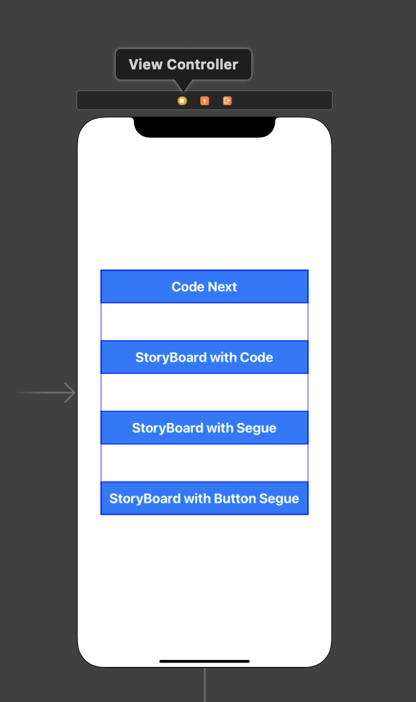
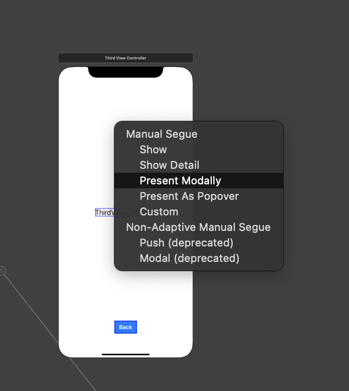
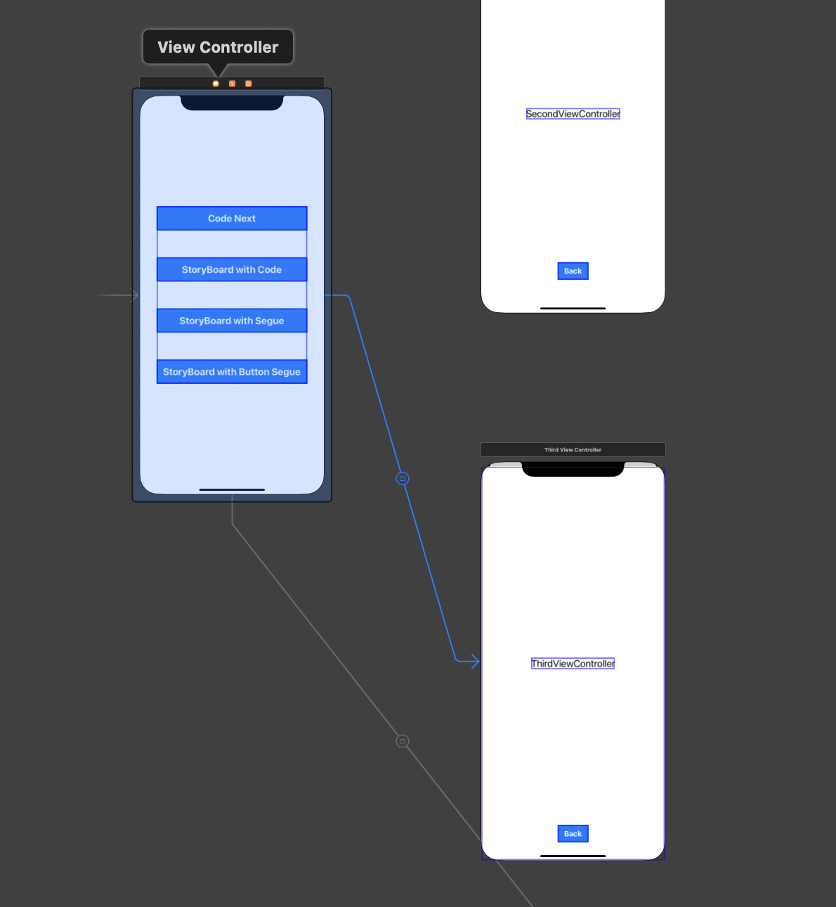
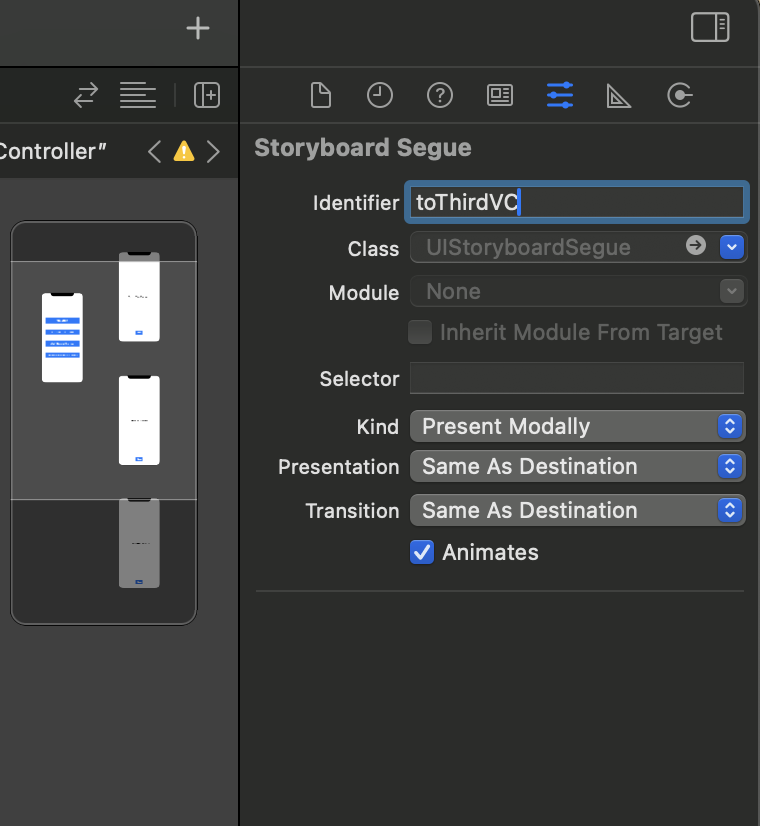
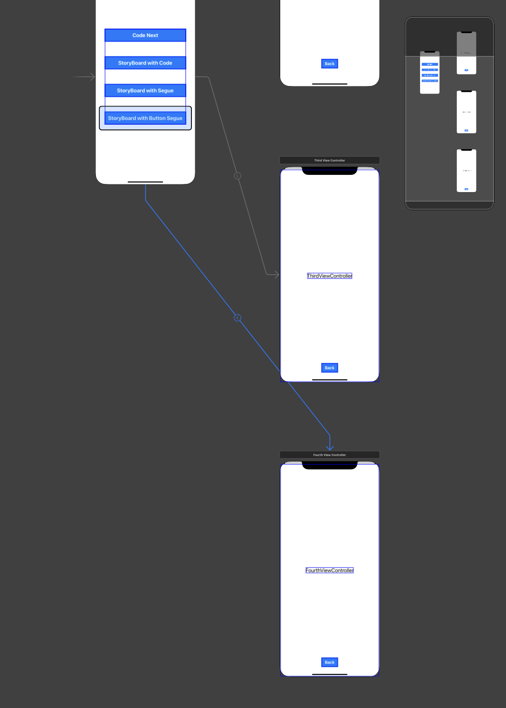

# 화면 이동과 데이터 전달
코코아터치 파일은 그냥 자동으로 상속받은 파일을 만들어준다.
```swift
class FirstViewController: UIViewController {
    override func viewDidLoad() {
        super.viewDidLoad()
        // Do any additional setup after loading the view.
    }
}
```

## 1. 코드로 화면 이동

### 글씨 올리기
1. 레이블 선언 (메모리에 올리기)
2. `addSubview` (뷰에 올리기)
3. 오토레이아웃 (false처리, isActive true)
### 버튼
1. 버튼 선언
2. setTitle 등등 버튼 설정
3. `addTarget` (버튼 동작 연결하기)
4. 셀렉터(`#selector()`)의 메서드 만들기 (`@objc` 함수)
5. `addSubview` (뷰에 올리기)
6. 오토레이아웃 (false처리, isActive true)
7. 코드 정리 (setup과 makeAutoLayout 함수), 버튼 클로저화 (클로저는 케바케)

```swift
class FirstViewController: UIViewController {
    
    let mainLabel = UILabel()
    let backButton = UIButton(type: .custom)

    override func viewDidLoad() {
        super.viewDidLoad()
        mainLabel.text = "FirstViewController"
        configureUI()
    }
    
    func configureUI() {
        view.backgroundColor = .gray
        
        // 레이블 관련 설정
        mainLabel.font = UIFont.systemFont(ofSize: 22)
        view.addSubview(mainLabel)
        
        // 레이블 오토레이아웃
        mainLabel.translatesAutoresizingMaskIntoConstraints = false
        mainLabel.centerXAnchor.constraint(equalTo: view.centerXAnchor).isActive = true
        mainLabel.centerYAnchor.constraint(equalTo: view.centerYAnchor).isActive = true
        
        // 버튼 관련 설정
        backButton.setTitle("Back", for: .normal)
        backButton.setTitleColor(.white, for: .normal)
        backButton.backgroundColor = .blue
        backButton.titleLabel?.font = UIFont.boldSystemFont(ofSize: 20)
        backButton.addTarget(self, action: #selector(backButtonTapped), for: .touchUpInside)
        view.addSubview(backButton)
        
        // 버튼 오토레이아웃
        backButton.translatesAutoresizingMaskIntoConstraints = false
        backButton.widthAnchor.constraint(equalToConstant: 70).isActive = true
        backButton.heightAnchor.constraint(equalToConstant: 40).isActive = true
        backButton.bottomAnchor.constraint(equalTo: view.bottomAnchor, constant: -40).isActive = true
        backButton.centerXAnchor.constraint(equalTo: view.centerXAnchor).isActive = true
    }
    
    @objc func backButtonTapped() {
        self.dismiss(animated: true, completion: nil)
    }

}
```

### 버튼을 클로저화 한다면
```swift
let backButton: UIButton = {
	let button = UIButton(type: .custom)
	button.setTitle("Back", for: .normal)
	button.setTitleColor(.white, for: .normal)
	button.backgroundColor = .blue
	button.titleLabel?.font = UIFont.boldSystemFont(ofSize: 20)
	button.addTarget(self, action: #selector(backButtonTapped), for: .touchUpInside)
    return button
}
```
- UIButton으로 타입을 지정하고 클로저로 할당해준다.
- `addSubview`도 클로저에 넣고 싶다면 `lazy var`로 선언해주기
	- 뷰보다 버튼먼저 생겨서 없는 뷰에다 올리려고하면 큰일남
## 다음 화면으로 넘어가기

넘어갈 뷰컨트롤러 인스턴스 생성 -> `present` 함수

```swift
@IBAction func codeNextButtonTapped(_ sender: UIButton) {
	let firstVC = FirstViewController()
	present(firstVC, animated: true, completion: nil)
}
```
- 뷰컨트롤러 인스턴스 생성 후 `present` 함수 사용
	- 때에 따라 화면 넘어갈때 무슨 동작이 필요하다면 `completion`에 클로저로 보내면 됨
### 꽉차는 화면으로 넘어가기
> 모달 modal 스타일 변경 가능함
- `modalPresentationStyle` 메서드 사용

```swift
@IBAction func codeNextButtonTapped(_ sender: UIButton) {
	let firstVC = FirstViewController()
	firstVC.modalPresentationStyle = .fullScreen
	present(firstVC, animated: true, completion: nil)
}
```

### 이전 화면으로 돌아가기
```swift
@objc func backButtonTapped() {
	self.dismiss(animated: true, completion: nil)
}
```

## 문자열 데이터 전달하기
- 데이터 받는 쪽에서 문자열 변수를 선언해야함 `someString`
- 이때 보통 **옵셔널로 선언함**

뷰컨트롤러(클래스)에서는 기본값이 없다면 에러가 발생함(물론 `= ""` 이런식으로 빈값을 넣을 수도 있긴 함)

기본값을 안주면 `override init`을 통해서 생성자를 따로 만들어줘야해서 복잡해짐

그래서 그냥 옵셔널로 선언함.
그럼 초기값이 `nil`로 설정 됨.

```swift
var someString: String?
```

- `mainLabel.text = someString`으로 바꾸면 됨
	- **이때 옵셔널 바인딩할 필요 없음**
	- 애초에 `mainLabel.text`가 옵셔널 타입임

```swift
override func viewDidLoad() {
        super.viewDidLoad()
        mainLabel.text = someString        
        configureUI()
    }
```

그리고 보내는 쪽에서 `someString` 값을 넣어주면 됨.
```swift
@IBAction func codeNextButtonTapped(_ sender: UIButton) {
	let firstVC = FirstViewController()
	
	firstVC.someString = "안녕하세요"
	
	firstVC.modalPresentationStyle = .fullScreen
	present(firstVC, animated: true, completion: nil)
}
```
- 이렇게 데이터 전달을 위한 변수를 선언하고
- 그 변수를 통해서 한번 거쳐서 전달하는게 일반적임

**여기서 데이터 보내는쪽에서 직접 접근하여 바꿀 수도 있지만
그렇게 사용하지 않고 문제가 많음**
```swift
@IBAction func codeNextButtonTapped(_ sender: UIButton) {
	let firstVC = FirstViewController()
	
	firstVC.mainLabel.text = "안녕하세요"
	
	firstVC.modalPresentationStyle = .fullScreen
	present(firstVC, animated: true, completion: nil)
}
```
- 코드상으론 가능하지만 스토리보드에선 불가능함.
- 스토리보드 매커니즘
	- 뷰컨트롤러 코드가 먼저 메모리에 올라감
	- 스토리보드가 메모리에 올라감
	- 코드랑 스토리보드랑 연결지음
- 이 과정에서 아직 연결중이라 메모리에 없어서 접근할 수 없다며 에러 발생함

## 2. 코드로 스토리보드 객체를 생성해서 화면 이동
1. 스토리보드에서 `ViewController`를 올려둔다.
2. 새로운 Swift 파일 혹은 Cocoa Touch Class 파일을 만들어준다.
3. 스토리보드와 클래스를 연결시켜 준다.
	1. 스토리보드 오른쪽 패널 네번째 탭에서 해당 클래스 이름을 넣어준다.
4. 레이블과 버튼 등을 컨트롤로 끌어다 연결시켜 준다.

이때, 코드로 단순히 뷰컨트롤러 인스턴스 생성하는 것으로는 연결되지 않는다.
```swift
@IBAction func codeNextButtonTapped(_ sender: UIButton) {
	let secondVC = SecondViewController()
}
```
- 이건 메모리에 올라간 인스턴스
- 스토리보드에서 만든 UI들은 힙 영역에 인스턴스가 따로 존재한다.

그 둘을 따로 연결해줘야한다. (`@IBOutlet`과 비슷하다.)
이때 필요한게 `storyboard?.instantiateViewController(withIdentifier: "")`

`withIdentifier`는 적당히 지어서 스토리보드에서 클래스 이름 연결시킨 곳 밑에 
`StoryBoard ID`에 똑같이 써서 연결해준다.

그 후 **타입캐스팅을 통해 `SecondViewController`로 타입을 바꿔야 한다.**
- `storyboard?.instantiateViewController(withIdentifier: "")`의 반환 타입은 `UIViewController`이기 때문. 구체적이지 않다.
```swift
@IBAction func storyboardWithCodeButtonTapped(_ sender: UIButton) {
	guard let secondVC = storyboard?.instantiateViewController(withIdentifier: "secondVC") as? SecondViewController else { return }
	secondVC.someString = "안녕하세요"
	// secondVC.mainLabel.text = "안녕하세요" (스토리보드 객체가 나중에 생김)
	present(secondVC, animated: true, completion: nil)
}
```
- ViewController 인스턴스와 Storyboard 인스턴스가 따로따로 생김
- 이 둘을 이어주는게 viewDidLoad 함수임
- 서로 연결되기 전에 접근하면 에러가 발생
- 그렇기 때문에 직접 접근하는게 아니라 따로 속성을 만들어서 인스턴스가 만들어진 뒤에 접근해야하는 것임


## 3. 스토리보드로 화면 이동 (간접 세그웨이)

### Segue(세그웨이)
> 화면이동을 담당하는 객체

|  |  |
| ------------------ | ------------------ |
- 스토리보드에서 화면을 보면 3가지 점 중 맨 왼쪽 노란색 버튼이 있다.
- 그것을 **컨트롤을 누른채** 이동하려는 화면으로 드래그하면
- 어떤 화면으로 띄울지 선택창이 뜬다. 이 중 `Present Modally`를 선택한다.

|  |  |
| ------------------ | ------------------ |
- 그러면 두 화면을 잇는 선이 생기는데 이것이 바로 **세그웨이**이다.
- 이것도 식별자(identifier)을 설정할 수 있다.

그 다음 버튼을 눌렀을 때 화면이 이동하도록 설정해야하므로 코드로 돌아간다.
화면을 이동하도록 하는건 세그웨이가 담당하고 있으므로 세그웨이를 활성화 해야한다.

```swift
@IBAction func storyboardWithSegueButtonTapped(_ sender: UIButton) {
	performSegue(withIdentifier: "toThirdVC", sender: self)
}
```
- `performSegue`는 세그웨이를 실행한다는 의미의 메서드 호출
- 세그웨이의 identifier를 정확히 입력하고
- sender는 `nil`을 써도 무방하지만 보통 `self`를 입력한다.
	- 보내는 요소가 `self` 즉 `ViewController`를 의미해서 일반적으로 이런식으로 많이 쓴다.

이 이후에는 어시스턴트를 띄운채 레이블과 버튼을 컨트롤 누르고 드래그하여 연결하고 백버튼을 설정해주면 된다.

```swift
class ThirdViewController: UIViewController {    
    @IBOutlet weak var mainLabel: UILabel!

    override func viewDidLoad() {
        super.viewDidLoad()
    }
    @IBAction func backButtonTapped(_ sender: UIButton) {
        self.dismiss(animated: true, completion: nil)
    }
}
```

### 세그웨이 방식으로 데이터 전달하기
조금 까다로운데 왜냐하면 코드 방식처럼 이전 뷰컨트롤러의 인스턴스를 생성하지 않아서 전달할 수가 없기 때문이다.

따로 `prepare`이라는 메서드를 **재정의**해서 사용해야한다.
인수로 세그웨이를 사용하기 때문이다.

```swift
override func prepare(for segue: UIStoryboardSegue, sender: Any?) {
	if segue.identifier == "toThirdVC" {
		let thirdVC = segue.destination as! ThirdViewController
		thirdVC.someString = "안녕하세요"
		// thirdVC.mainLabel.text = "안녕하세요"    // 에러발생 (스토리보드 객체가 나중에 생김)
	}
}
```
- 이때 해당 세그웨이에 접근해서 데이터를 전달해줄 수 있다.
- 먼저 identifier를 확인한다.
- 세그웨이의 `destination`은 종착지를 뜻하는데 이것이 바로 thirdVC로 사용할 수 있다.
- 단, 타입이 `UIViewController`이기 때문에 `ThirdViewController`로 타입캐스팅을 해야한다.

그 후, ThirdVC에서 someString이라는 옵셔널 변수로 데이터를 받으면 된다.
```swift
class ThirdViewController: UIViewController {
    @IBOutlet weak var mainLabel: UILabel!
    
    var someString: String?
    
    override func viewDidLoad() {
        super.viewDidLoad()
        mainLabel.text = someString
    }
    
    @IBAction func backButtonTapped(_ sender: UIButton) {
        self.dismiss(animated: true, completion: nil)
    }
}
```


앞서
```swift
@IBAction func storyboardWithSegueButtonTapped(_ sender: UIButton) {
	performSegue(withIdentifier: "toThirdVC", sender: self)
}
```
`performSegue`로 세그웨이가 활성화 될텐데, 
**이때 내부에서 자동적으로 `prepare` 메서드가 실행된다.**
그래서 세그웨이를 통해 데이터 전달이 가능해진다.

세그웨이 방식은 복잡해서 보통 코드로 구현하긴 한다.

## 4. 스토리보드에서의 화면 이동(직접 세그웨이)


- 이번엔 3번째와 다르게 **버튼을 컨트롤을 누른채 드래그하여 4번째 화면에 연결해준다.** 똑같이  `Present Modally`를 선택한다.

차이점은 3번째는 화면 자체에서 세그웨이를 연결했다면,
**4번째는 버튼에서 직접적으로 세그웨이를 연결했다. 그래서 `performSegue`메서드를 호출하지 않아도 4번째 화면으로 이동이 된다.**

### 데이터 전달하기
3번째와 마찬가지로 `prepare` 메서드를 재정의하여 사용하면 된다.

```swift
override func prepare(for segue: UIStoryboardSegue, sender: Any?) {
	if segue.identifier == "toThirdVC" {
		let thirdVC = segue.destination as! ThirdViewController
		thirdVC.someString = "안녕하세요"
	}
	
	if segue.identifier == "toFourthVC" {
		let fourthVC = segue.destination as! FourthViewController
		fourthVC.someString = "안녕하세요"
	}
}
```

### 직접 세그웨이 방식에서만 호출되는 메서드
> 어떤 조건에 따라 다음화면으로 이동할지 말지 결정하는 메서드이다.

`shouldPerformSegue` 메서드는 버튼을 직접 연결하는 방식인 **직접 세그웨이 방식에서만 내부적으로 호출된다.**
```swift
override func shouldPerformSegue(withIdentifier identifier: String, sender: Any?) -> Bool {
	if identifier == "toFourthVC" {
		return false
	}
	return true
}
```

#### 왜 간접 세그웨이 방식에서는 호출되지 않나?
> 간접 세그웨이는 **`performSegue` 메서드를 호출해야지만 다음화면으로 이동할 수 있는데 이때 조건 설정이 가능하기 때문에** 굳이 `shouldPerformSegue` 메서드를 호출하지 않는다.

가장 추천하는 방식은 2번째, 코드로 스토리보드 객체를 생성해서 화면 이동하는 방식이다. 이게 가장 간편하다.